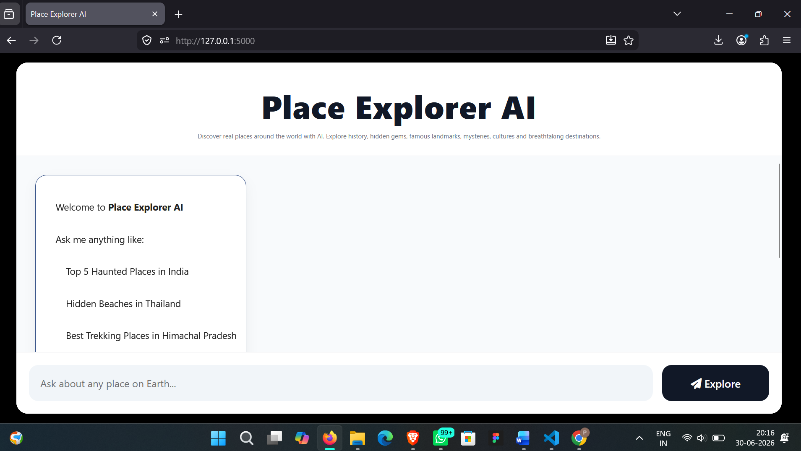
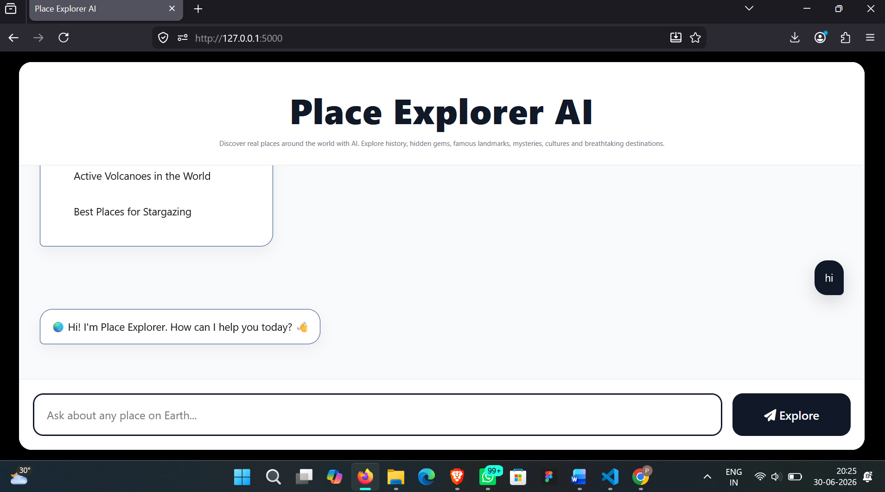
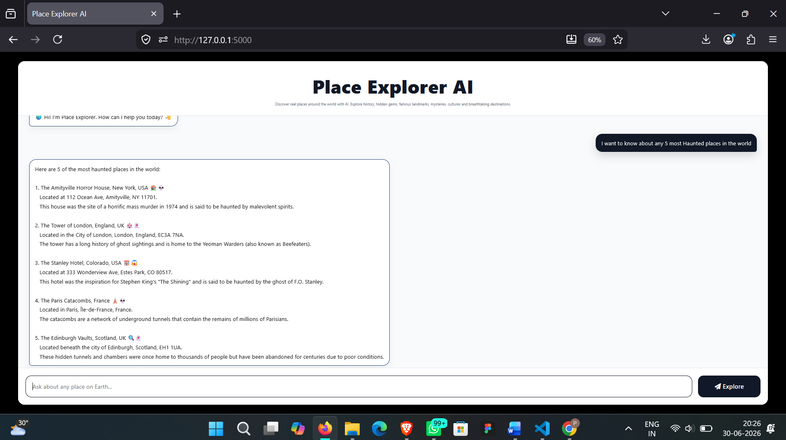

# 🌍 Place Explorer AI

An AI-powered travel and location discovery assistant that helps users explore real places around the world through natural language conversations.

Place Explorer AI provides information about historical monuments, tourist attractions, hidden gems, natural wonders, haunted locations, beaches, mountains, temples, museums, and much more. The application is powered by **Ollama (Llama 3.2)** and built using **Flask**.

---

## ✨ Features

- 🤖 AI-powered conversational assistant
- 🌍 Explore real places around the world
- 🏰 Discover historical monuments and landmarks
- 🏝 Find beaches, waterfalls, mountains, forests, and islands
- 👻 Learn about haunted and mysterious locations
- 📍 Provides exact location details
- 📖 Gives history and interesting facts about places
- 💬 Interactive chatbot interface
- 🎨 Responsive and modern UI
- 👋 Handles greetings intelligently

---

## 🛠 Tech Stack

- Python
- Flask
- Ollama
- Llama 3.2
- HTML5
- CSS3
- JavaScript

---

## 📂 Project Structure

```
PlaceExplorerAI/
│
├── static/
│   ├── style.css
│   └── script.js
│
├── templates/
│   └── index.html
│
├── app.py
├── README.md
└── requirements.txt
```

---

## ⚙ Installation

### Clone the repository

```bash
git clone https://github.com/YourUsername/PlaceExplorerAI.git
```

### Move into the project

```bash
cd PlaceExplorerAI
```

### Install dependencies

```bash
pip install flask ollama
```

### Make sure Ollama is installed

Download Ollama from:

https://ollama.com

Pull the model:

```bash
ollama pull llama3.2
```

### Run Ollama

```bash
ollama serve
```

### Start Flask

```bash
python app.py
```

Open your browser:

```
http://127.0.0.1:5000
```

---

## 💬 Example Queries

- Tell me about the Eiffel Tower.
- Give me the top 5 haunted places in the world.
- Best waterfalls in India.
- Hidden gems in Japan.
- Famous temples in Tamil Nadu.
- Historical monuments in Delhi.
- Best trekking places in Himachal Pradesh.
- Beautiful beaches in Thailand.

---

## 📸 Application Screenshots

### Home Page



### Chat Response



### Place Information



---

## 🚀 Future Enhancements

- Google Maps Integration
- Real-time Place Images
- Weather Information
- Voice Search
- Favorites
- Search History
- Dark Mode
- AI Travel Itinerary Planner
- Nearby Attractions
- Multi-language Support

---

## 👨‍💻 Author

**Praneetha Sai Mogilisetti**

B.Tech Computer Science Engineering

Passionate about AI, Web Development, and UI/UX Design.

---
